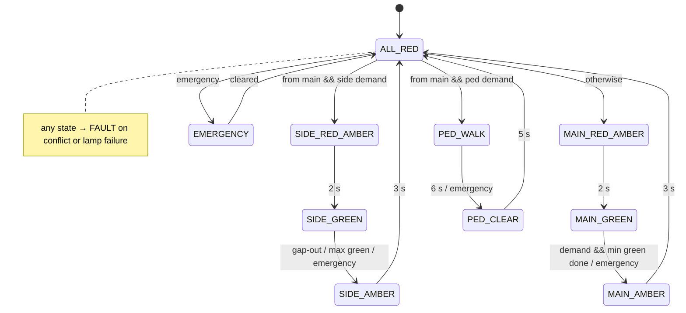

# 02 · Smart Traffic-Light Controller

A main-road / side-road junction with a pedestrian crossing, written as a **finite-state machine** with no `delay()` anywhere. It uses the UK sequence (red → red+amber → green → amber → red). The main road rests on green, and the side road and crossing are only served when something is waiting.

## Features

| Feature | How it works |
|---|---|
| **Demand-driven phases** | Side road and crossing are served only when their button or sensor latches a demand |
| **Minimum green** | The main road always keeps green for at least 8 s before it can be interrupted |
| **Vehicle-actuated extension** | Each car detected during side-road green adds 2 s, up to a 15 s maximum ("gap-out" / "max-out") |
| **All-red clearance** | 2 s of all-red between conflicting phases |
| **Pedestrian phase** | Steady green man, then flashing green man, with a 7-segment countdown and crossing pips |
| **WAIT lamp** | Lights when a pedestrian demand is registered |
| **Emergency mode** | Greens are ended safely through amber, then the junction holds all-red until cleared |
| **Conflict monitor** | An independent check on the *outputs* (not the state table): conflicting greens → fault |
| **Red-lamp proving** | Senses current through each vehicle red. A blown red → fault |
| **Fail-safe** | In a fault, both roads flash amber and pedestrian lamps go dark. The fault is latched until reset |

## State diagram



The code keeps two concerns separate:

- `updateStateMachine()` decides **when** to change state (timers + demands)
- `lampsForState()` decides **what** is lit in each state

The conflict monitor then checks the result independently. This mirrors real signal controllers, where the safety monitor is separate from the logic that sequences the lights.

## Parts

| Qty | Part |
|---|---|
| 3 | Red LEDs (main, side, red man) |
| 2 | Yellow LEDs (ambers) |
| 3 | Green LEDs (main, side, green man) |
| 8 | 220 Ω resistors for LEDs + 7 more for the 7-segment |
| 3 | Push buttons (pedestrian, vehicle sensor, emergency) |
| 1 | Active buzzer |
| 1 | 74HC595 shift register |
| 1 | 1-digit 7-segment display (kit's 5161AS is common cathode) |

## Wiring

| Arduino | Connects to |
|---|---|
| D4 / D5 / D6 | Main road red / amber / green |
| D7 / D8 / D9 | Side road red / amber / green |
| D10 / D11 | Red man / green man |
| D2 | Pedestrian button → GND |
| D3 | Side-road vehicle sensor button → GND |
| A3 | Emergency button → GND (press = toggle, hold 3 s = reset fault) |
| D12 | Active buzzer (+), buzzer (–) to GND |
| D13 | WAIT lamp (the on-board "L" LED; add LED + 220 Ω if you want it external) |
| A0 / A1 / A2 | 74HC595 DS (14) / ST_CP (12) / SH_CP (11) |
| A4 / A5 | Red-lamp sense for main / side red (see below) |

**Normal LED:** `pin → LED anode, LED cathode → 220 Ω → GND`

**Proved red LED** (main and side reds only): wire it exactly the same way, then add a wire from the LED–resistor junction to A4 (or A5):

```
 D4 ──►|── ┬ ──[220Ω]── GND
     red   │
           └── A4   (≈3 V when the lamp is lit, 0 V if it's blown or off)
```

**74HC595 → 7-segment:** Q0–Q6 → segments a–g through 220 Ω each, Q7 → dp, MR (10) → 5V, OE (13) → GND, VCC (16) → 5V, GND (8) → GND, and the display's common pin → GND. For a common-anode display, set `SEGMENT_COMMON_ANODE = true` and connect common to 5V.

If you'd rather skip lamp proving at first, set `LAMP_PROVING = false`.

## Running it

Upload `traffic_controller/traffic_controller.ino`. No extra libraries are needed. Open the Serial Monitor at **115200** to watch every transition and the reason for it:

```
# 12.0s  MAIN_GREEN -> MAIN_AMBER  (pedestrian demand)
# 15.0s  MAIN_AMBER -> ALL_RED  (amber done)
# 17.0s  ALL_RED -> PED_WALK  (serve pedestrians)
```

You can also drive it with no buttons wired: type `ped`, `car`, `emergency`, `fault`, `reset`, `mute` or `status`.

## Tests to run and record

| # | Test | Expected |
|---|---|---|
| 1 | No demands | Main road stays green indefinitely |
| 2 | Press pedestrian at t = 2 s | WAIT on. The change waits until 8 s of main green, then amber → all-red → walk |
| 3 | Press car once | Side road gets 5 s green then gaps out |
| 4 | Keep pressing car every second | Green extends but ends at 15 s (max-out) |
| 5 | Press ped + car together | Side road first, then main green again, then pedestrians. The main road is never starved |
| 6 | Emergency during side green | Side amber → all-red → holds. Press again → main red+amber → green |
| 7 | Pull out the main red LED | Flashing amber within ~0.1 s, serial shows `lamp fault` |
| 8 | Type `fault` then `reset` | Flashing amber, then a safe restart through all-red |

Filming tests 6 and 7 makes a good demo video for GitHub.

## Ideas to extend it

- **Night mode:** the LDR switches the junction to flashing amber, or to a shorter main minimum green at night
- **Queue estimation:** the HC-SR04 ultrasonic sensor measures "queue length" and scales the green time
- **Timing plan table:** move all the timings into a struct so you can switch between peak and off-peak plans over serial
- **Unit-test the FSM on a PC:** compile `updateStateMachine()` with a fake `millis()` and check the sequences automatically
